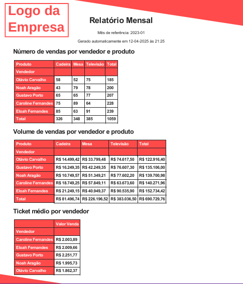

# 🧾 Gerador de Relatórios Mensais em PDF

Este projeto automatiza a geração de relatórios mensais com dados de uma planilha Excel, renderizando em HTML com Jinja2 e exportando para PDF com layout personalizado.

## 💡 Funcionalidades

- 📥 Carregamento e filtragem de dados por mês  
- 📊 Geração de tabelas dinâmicas (quantidade, volume, ticket médio)  
- 🎨 Estilização com CSS customizado  
- 🖨️ Exportação para PDF com layout sobreposto  

## 📸 Demonstração

### ▶️ Processo completo em ação:


### 🧾 Tabelas estilizadas no template:


### 📄 PDF Final com layout:


## ⚙️ Como usar

1. Clone o repositório:

```bash
git clone https://github.com/Caua1705/Gerando-Relat-rios-PDF-via-Excel.git
cd Gerando-Relatorios-PDF-via-Excel

